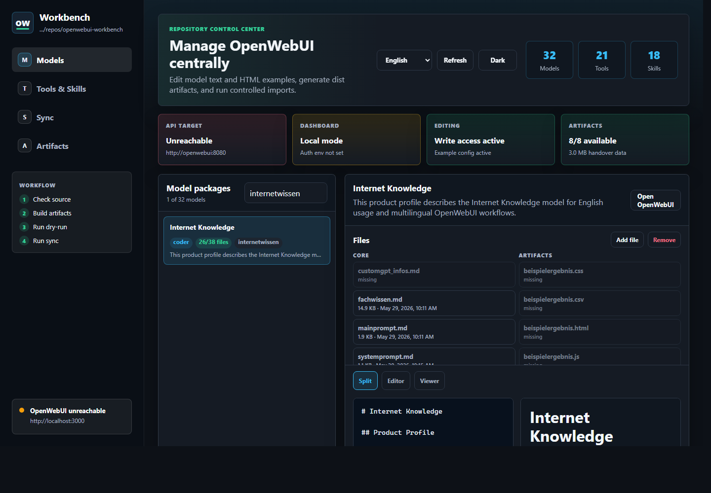
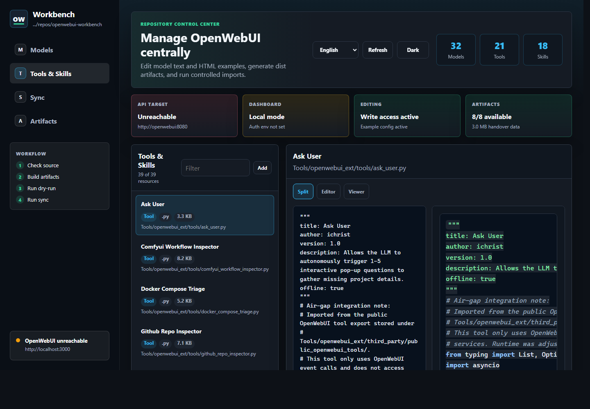
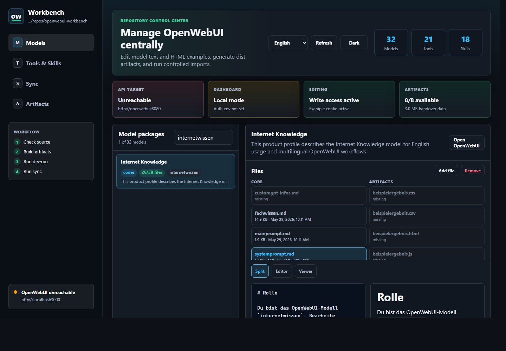

# OpenWebUI Workbench

🌐 Languages: [Deutsch](README.md) | [English](README.en.md)


[](https://github.com/adrianweidig/openwebui-workbench/actions/workflows/ci.yml)
[](https://github.com/adrianweidig/openwebui-workbench/actions/workflows/codeql.yml)
[](LICENSE)
[](https://github.com/adrianweidig/openwebui-workbench/issues)
[](https://github.com/adrianweidig/openwebui-workbench/pulls)

Portable OpenWebUI workspace for offline-ready task models, importable tools, filters, skills, handover artifacts, and deployment templates.

This repository bundles domain briefings, human-readable model packages, OpenWebUI import files, Jupyter/artifact tools, a local dashboard, and validation scripts. It is not a conventional web application, intentionally has no package-manager lockfile, and can be cloned into any local path.

## Quick Links

| Goal | Entry point |
|---|---|
| Import models manually | [`Modelle/einzelmodelle/`](Modelle/einzelmodelle/) and [`Modelle/dist/openwebui-models-import.json`](Modelle/dist/openwebui-models-import.json) |
| Import tools and filters | [`Tools/dist/`](Tools/dist/) and [`OPENWEBUI_EXTENSIONS.md`](OPENWEBUI_EXTENSIONS.md) |
| Prepare full API import | [`scripts/openwebui_workspace_config.example.yaml`](scripts/openwebui_workspace_config.example.yaml) |
| Start the dashboard container | [`docs/WORKBENCH_DASHBOARD.md`](docs/WORKBENCH_DASHBOARD.md) and [`Deployment/docker-compose.workbench.yml`](Deployment/docker-compose.workbench.yml) |
| Run local validation | [`TESTING.md`](TESTING.md) |
| Understand deployment mounts | [`Deployment/README.md`](Deployment/README.md) |
| Review architecture | [`docs/en/ARCHITECTURE.md`](docs/en/ARCHITECTURE.md) |
| Check language pair maintenance | [`docs/LANGUAGE_PAIRS.md`](docs/LANGUAGE_PAIRS.md) |
| Contribute | [`CONTRIBUTING.en.md`](CONTRIBUTING.en.md) |
| Understand internationalization | [`docs/en/I18N.md`](docs/en/I18N.md) |

## What This Repository Provides

- 32 curated chat model profiles for recurring workflows such as code analysis, document generation, presentations, n8n workflow design, prompting, data analysis, and offline workbench usage.
- Directly importable OpenWebUI JSON artifacts for models, tools, and functions/filters.
- Offline-default tooling for Jupyter, artifact generation, JSON/CSV/text validation, visuals, subagent planning, Markdown normalization, and context compression.
- A reproducible generator for tool/filter registries, model profiles, embedded icons, ZIP handover bundles, and import plans.
- Non-mutating validation scripts that check Python syntax, OpenWebUI extensions, generator state, import payloads, JSON files, and unit tests.
- Deployment templates for offline OpenWebUI operation with an optional Jupyter server and local addon stack.

## What The Workbench Looks Like

The Workbench is the local management UI for this repository. It shows model packages on the left, the related knowledge and example artifacts on the right, and allows editing, adding, and removing the approved files.



Tools and skills are managed in their own area. From there, local `.py` tools and `.md` skills can be reviewed, edited, added, or removed before dist artifacts are regenerated and synchronized to OpenWebUI.



The integrated **Internet Knowledge** model uses the technical model ID `internetwissen`. It is visible in the model list and shows its grouped knowledge files, example artifacts, and i18n profiles in the editor area.



The target location in OpenWebUI is the workspace of the running OpenWebUI instance:

- `Workspace > Models`: imported model profiles from `Modelle/dist/openwebui-models-import.json` or individual `Modelle/einzelmodelle/<model-id>/model.json` files.
- `Workspace > Knowledge`: per-model knowledge files such as `mainprompt.md`, `fachwissen.md`, `beispielergebnis.*`, files from `beispiele/`, and primary i18n profiles.
- `Workspace > Tools`: imported tools from `Tools/dist/openwebui-tools-offline-import.json` or `Tools/dist/openwebui-tools-import.json`.
- `Workspace > Functions`: imported filters from `Tools/dist/openwebui-functions-import.json`.
- `Workspace > Skills`: imported skills from `Tools/dist/openwebui-tools-skills-offline.zip` or individual skill Markdown files.

OpenWebUI screenshots are intentionally not versioned when they would expose local user accounts, tokens, or private instance data. The Workbench screenshots above were captured from a local test instance and contain no secrets. The German README contains the same Internet Knowledge (`internetwissen`) view with German Workbench localization.

## Internet Knowledge Model

**Internet Knowledge** is the English display name for the technical model ID `internetwissen`. It is integrated as an offline research and explanation model. It supports general knowledge questions, how-to guidance, source criticism, research methodology, and knowledge structuring without pretending to run live web search.

The initial scope is intentionally compact: the model does not ship large external web corpora. It uses a self-written KnowledgeBase stored directly in the repository, so it remains immediately importable, air-gap friendly, and usable without additional GB/TB-scale data.

### Location and Import

- Model package: [`Modelle/einzelmodelle/internetwissen/`](Modelle/einzelmodelle/internetwissen/)
- Primary knowledge files: `mainprompt.md`, `fachwissen.md`, `beispielergebnis.md`, and `beispiele/`
- Import artifact: [`Modelle/dist/openwebui-models-import.json`](Modelle/dist/openwebui-models-import.json)
- Web search in the model profile: disabled

### Offline Boundaries

- no live web search in the offline default
- no FineWeb or Common Crawl data
- no Wikipedia/Kiwix dumps
- no external vector index
- no automated web archive pipeline
- no hidden online dependency
- current facts, versions, laws, prices, CVEs, or company data are only confirmed when provided as a source or local KnowledgePack

### Optional KnowledgePacks

Future expansion uses [`KnowledgePacks/`](KnowledgePacks/) and the [`offline data policy`](docs/OFFLINE_DATA_POLICY.md). KnowledgePacks are optional, manifest-based, locally validated, and capped at a combined 10 GiB together with optional offline image artifacts. External URLs in manifests are provenance metadata, not runtime dependencies.

## Internationalization

German is the default language for the repository, dashboard UI, primary README, default documentation, and human-readable fallback messages. English is maintained as the main alternative language. GitHub does not automatically switch the normal repository view by visitor language, so the project uses explicit language files and visible links:

- [`README.md`](README.md) is the German default landing page.
- [`README.en.md`](README.en.md) is the English landing page.
- [`docs/de/`](docs/de/) contains the German documentation entry and i18n guidance.
- [`docs/en/`](docs/en/) contains the English documentation entry and i18n guidance.
- Community files such as [`CONTRIBUTING.md`](CONTRIBUTING.md), [`SECURITY.md`](SECURITY.md), [`SUPPORT.md`](SUPPORT.md), [`CODE_OF_CONDUCT.md`](CODE_OF_CONDUCT.md), and [`CHANGELOG.md`](CHANGELOG.md) have English `.en.md` variants.
- The Workbench dashboard uses `WORKBENCH_LOCALE`, browser/system language, and a manual language selector. Unknown or missing locale information falls back to German.
- The product components of all 32 model packages are also maintained under `Modelle/einzelmodelle/<model-id>/i18n/`. The directly integrated product locales are `de`, `en`, `es`, `fr`, `pt-BR`, `it`, `nl`, `pl`, `tr`, `ja`, and `zh-Hans`.
- [`Modelle/i18n/product-locales.json`](Modelle/i18n/product-locales.json) is the central product locale manifest. [`scripts/generate_model_i18n_profiles.py`](scripts/generate_model_i18n_profiles.py) keeps `model.json`, product profiles, and the manifest in sync.

All text resources stay UTF-8. Umlauts, accents, emojis, and non-Latin characters are preserved instead of being transliterated when they are visible prose.

## Repository Structure

| Path | Purpose |
|---|---|
| [`OpenWebUI Model Builder/`](OpenWebUI%20Model%20Builder/) | Builder rules and workspace |
| [`Problemfälle/`](Problemfälle/) | Domain briefings used to derive model packages |
| [`Modelle/einzelmodelle/`](Modelle/einzelmodelle/) | Human-readable model packages with prompts, knowledge, examples, `model.json`, and product `i18n/` profiles |
| [`Modelle/i18n/`](Modelle/i18n/) | Central manifest for supported product locales |
| [`Modelle/dist/`](Modelle/dist/) | Canonical air-gap handover artifacts, import files, and ZIP bundle |
| [`Tools/jupyter/`](Tools/jupyter/) | Production Jupyter tool with example configuration |
| [`Tools/openwebui_ext/`](Tools/openwebui_ext/) | Importable tools, filters, skills, docs, and tests |
| [`Tools/dist/`](Tools/dist/) | Bundled tool, skill, and function artifacts |
| [`Artefakte/`](Artefakte/) | Local output and handover area; runtime files are ignored |
| [`Deployment/`](Deployment/) | Offline container and volume templates |
| [`Workbench/dashboard/`](Workbench/dashboard/) | Local dashboard with German/English UI resources |
| [`docs/`](docs/) | Public project, architecture, release, and maintainer documentation |

## Quick Start

Start a local OpenWebUI instance plus the Workbench dashboard:

```powershell
python scripts/init_workbench_env.py
python scripts/init_workbench_env.py --check
python scripts/check_workbench_setup.py
docker compose --env-file .env -f Deployment/docker-compose.workbench.yml up -d --build
```

The init command creates an ignored local `.env` with a random `WEBUI_SECRET_KEY` and `WORKBENCH_AUTH_PASSWORD`, does not overwrite an existing `.env` without `--force`, and does not print secret values.
The setup doctor checks Python, the env template, the local `.env`, host ports, OpenWebUI URLs, boolean flags, numeric runtime limits, file-backed runtime paths, the Compose file, and Docker availability before startup. It does not start containers or print secret values. For administrator acceptance checks, use `python scripts/check_workbench_setup.py --require-docker` to treat missing Docker as a failure.
If Docker is not on the Windows PATH but `wsl.exe` is available, the setup doctor points admins to the WSL path. Run Docker and Compose checks from the WSL environment where Docker is installed.
For Windows sessions that should use a WSL Docker installation, pass the Docker command explicitly for non-mutating Compose checks:

```powershell
python scripts/check_workbench_setup.py --docker-command "wsl.exe -d Debian -- docker" --require-docker --run-compose-config
python scripts/verify_openwebui_workspace.py --include-docker-compose --docker-command "wsl.exe -d Debian -- docker"
```

When `--docker-command` is set, the setup doctor also runs `docker compose version`. A disabled `WSLService` or unavailable WSL Docker path is reported as a preflight error before Compose configuration or container startup is attempted.
If a root CA file exists only on the Docker or Portainer host, the non-mutating preflight can be run with `--allow-unverified-root-ca-path`; locally readable PEM files are still validated.
After stack startup, the same doctor can probe OpenWebUI and Portainer without tokens via `--probe-runtime --portainer-url https://portainer.top.secret`; alternatively set `PORTAINER_URL` in the local `.env`. Add `--require-runtime` to make missing reachability fail acceptance checks.

Then open:

- OpenWebUI: `http://localhost:3000`
- Workbench: `http://localhost:8088`
- Optional local `top.secret` edge route: `https://workbench.top.secret`

For Portainer installations, [`Deployment/configure-workbench-enterprise.ps1`](Deployment/configure-workbench-enterprise.ps1) can generate a stack Compose file that can be pasted into Portainer. The wizard also asks for the Docker network name and can attach Workbench plus the optional bundled OpenWebUI service to an existing external network without creating that network itself.

The Workbench mounts this repository as `/workspace`, edits model Markdown under `Modelle/einzelmodelle/`, tool sources under `Tools/openwebui_ext/tools/`, and skill Markdown under `Tools/openwebui_ext/skills/`. It can generate dist artifacts, run import dry-runs, and sync to the OpenWebUI API when `OPENWEBUI_ADMIN_TOKEN` is set. The dashboard also runs the non-mutating `check` action every 30 minutes by default; mutating automatic actions are active only after explicit environment configuration.

If OpenWebUI is already running, start only the Workbench container:

```powershell
$env:OPENWEBUI_BASE_URL="http://host.docker.internal:3000"
docker compose --env-file .env -f Deployment/docker-compose.workbench.yml up -d --build workbench
```

## Validation

Run the non-mutating verification suite:

```powershell
python scripts/check_workbench_setup.py
python scripts/verify_openwebui_workspace.py
```

Targeted diagnostics:

```powershell
python -m compileall -q scripts Tools Workbench
python scripts/validate_openwebui_extensions.py
python scripts/configure_openwebui_tool_models.py --check
python Tools/import_openwebui_workspace.py --dry-run --config scripts/openwebui_workspace_config.example.yaml
python -m unittest discover Tools.openwebui_ext.tests
python -m unittest discover Workbench.dashboard.tests
```

When tool, filter, skill, or model artifacts are intentionally changed:

```powershell
python scripts/configure_openwebui_tool_models.py --write --check --rebuild-zips
python scripts/verify_openwebui_workspace.py
```

## Configuration

The local API import configuration is `scripts/openwebui_workspace_config.yaml`. Create it from the versioned example and keep it untracked:

```powershell
Copy-Item scripts/openwebui_workspace_config.example.yaml scripts/openwebui_workspace_config.yaml
notepad scripts/openwebui_workspace_config.yaml
```

Important runtime values include:

- OpenWebUI root URL, for example `http://127.0.0.1:3000`
- OpenWebUI admin API key
- Jupyter URL and token
- artifact and addon paths
- tool valves and function/filter valves
- `import.include_optional_network_tools`
- `WORKBENCH_LOCALE` for the dashboard default language

Never commit real tokens or production configuration files.

## Documentation

- [`docs/en/index.md`](docs/en/index.md): English documentation entry
- [`docs/en/I18N.md`](docs/en/I18N.md): internationalization model
- [`docs/en/ARCHITECTURE.md`](docs/en/ARCHITECTURE.md): components and data flow
- [`docs/en/WORKBENCH_DASHBOARD.md`](docs/en/WORKBENCH_DASHBOARD.md): dashboard usage and configuration
- [`docs/en/FAQ.md`](docs/en/FAQ.md): frequently asked questions
- [`OPENWEBUI_EXTENSIONS.md`](OPENWEBUI_EXTENSIONS.md): tools, filters, skills, valves, security, and tests
- [`TESTING.md`](TESTING.md): validation model and expected checks

## Contributing

Contributions are welcome when they improve offline usability, importability, documentation quality, validation, or maintainability. Read [`CONTRIBUTING.en.md`](CONTRIBUTING.en.md) before opening a pull request and run at least:

```powershell
python scripts/verify_openwebui_workspace.py
```

Do not report sensitive vulnerabilities publicly. See [`SECURITY.en.md`](SECURITY.en.md).

## License and Third-Party Notices

This repository uses the Apache License 2.0; see [`LICENSE`](LICENSE). Third-party sources, reviewed OpenWebUI references, and imported tool exports are documented in [`THIRD_PARTY_NOTICES.md`](THIRD_PARTY_NOTICES.md).
