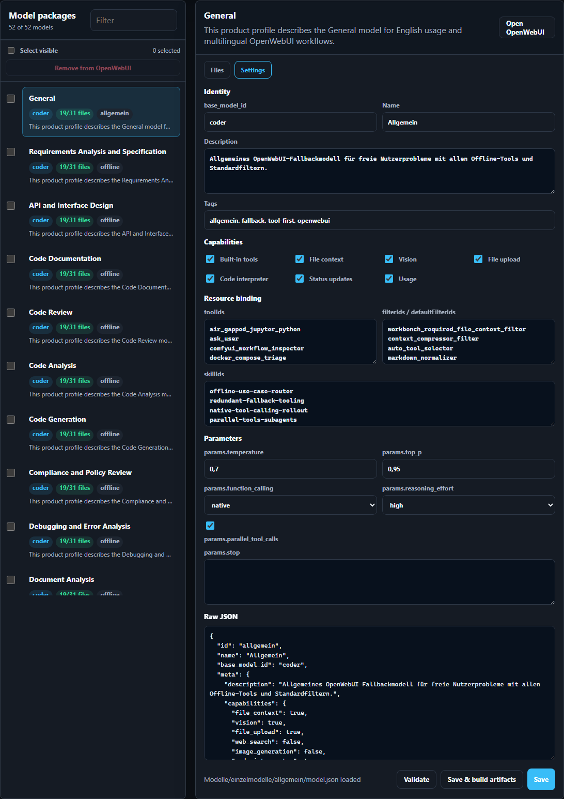
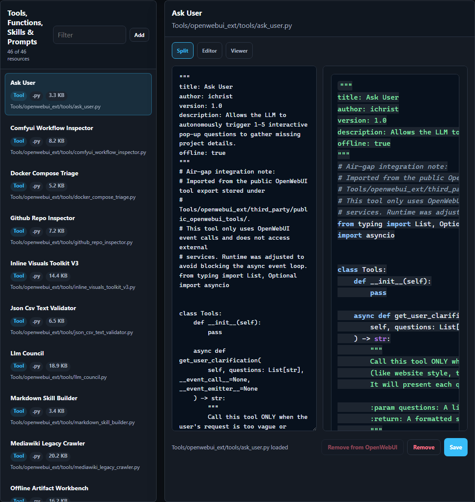

# OpenWebUI Workbench

Languages: [English](README.md) | [Deutsch](README.de.md)


[](https://github.com/adrianweidig/openwebui-workbench/actions/workflows/ci.yml)
[](https://github.com/adrianweidig/openwebui-workbench/actions/workflows/codeql.yml)
[](https://github.com/adrianweidig/openwebui-workbench/actions/workflows/dependency-review.yml)
[](https://github.com/adrianweidig/openwebui-workbench/actions/workflows/security-scorecard.yml)
[](https://github.com/adrianweidig/openwebui-workbench/actions/workflows/release-artifact.yml)
[](https://github.com/adrianweidig/openwebui-workbench/actions/workflows/docker-workbench-dashboard.yml)
[](LICENSE)

OpenWebUI Workbench is a set of ready-to-import custom GPT-style models for OpenWebUI.

The idea is simple: instead of arguing with a blank base model, users pick a task model, describe the problem, and get a strong first answer. Each model package contains the things that usually make the difference: domain knowledge, a main prompt, a system prompt, examples, recommended tools, filters, skills, and model settings.

The bundled prompts and knowledge files were generated and refined with GPT-5.5 Pro so the resulting behavior can be used locally through OpenWebUI, including air-gapped or private deployments.

## Workbench Screenshots

The recommended way to use this repository is the Workbench dashboard container. It edits the repository volume directly, then regenerates and syncs OpenWebUI import artifacts from that source.



The **Settings** tab edits the model's `model.json`: `base_model_id`, name, description, tags, capabilities, tool/filter/skill bindings, runtime parameters, and raw JSON.



Tools, filters, skills, and prompts are maintained in the same dashboard, so the model package and its OpenWebUI resources stay together.

## What You Get

- Task models for code review, debugging, document analysis, document generation, n8n workflows, test cases, presentations, data analysis, localization, support tickets, and more.
- One editable `model.json` per model, including `base_model_id`, name, tags, capabilities, tools, filters, skills, and runtime parameters such as `temperature`, `top_p`, `reasoning_effort`, and `parallel_tool_calls`.
- `mainprompt.md`, `fachwissen.md`, and `Golden_Example.*` files that are injected as required model context during API import.
- Importable OpenWebUI artifacts under `Modelle/dist/` and `Tools/dist/`.
- A local Workbench dashboard for editing model files, model settings, tools, filters, skills, prompt templates, and import artifacts.
- Offline-first defaults. Network-capable tools exist, but they are not part of the safe default import path.

## Fastest Start

Prerequisites:

- Docker with Docker Compose
- A running OpenWebUI instance
- An OpenWebUI base model available under the model ID you want to use. The repository default is `coder`; point that ID at your preferred local model or change it per model in the dashboard.

Start the Workbench dashboard container:

```powershell
if (-not (Test-Path .env)) { Copy-Item Deployment/workbench.env.example .env }
# Edit .env: set WORKBENCH_AUTH_PASSWORD and OPENWEBUI_BASE_URL.
docker compose --env-file .env -f Deployment/docker-compose.workbench.yml pull workbench
docker compose --env-file .env -f Deployment/docker-compose.workbench.yml up -d
```

Open:

- Workbench: `http://localhost:8088`
- OpenWebUI: whatever URL you configured in `.env`, usually `http://localhost:3000`

`Deployment/docker-compose.workbench.yml` starts one container: the Workbench dashboard. It does not start or replace your OpenWebUI server. Point `OPENWEBUI_BASE_URL` at the OpenWebUI instance you already use.

For local development of the dashboard image, build from the checkout instead:

```powershell
docker compose --env-file .env -f Deployment/docker-compose.workbench.yml up -d --build
```

## Import A Model

1. Open the Workbench dashboard.
2. Pick a model under `Modelle/einzelmodelle/`.
3. Open the **Model Settings** tab.
4. Set `base_model_id` to your local OpenWebUI model, for example `coder`, `mistral-medium-3.5-128b`, or another model ID from your instance.
5. Adjust temperature, `top_p`, tools, filters, skills, tags, or capabilities if needed.
6. Save and regenerate import artifacts.
7. Import through the dashboard sync action or import `Modelle/dist/openwebui-models-import.json` manually in OpenWebUI.

For the best result, use the API import path. It uploads the required prompt and knowledge files as real OpenWebUI files and keeps the model profile, tools, filters, skills, and knowledge wiring together.

## Daily Workflow

Use the Workbench like a small control room for OpenWebUI model packages:

- edit prompts and domain knowledge as Markdown
- tune each model's `model.json`
- regenerate import artifacts
- run an import dry-run
- compare local models with OpenWebUI
- sync models, tools, filters, skills, and prompt templates when an admin token is configured

The repository stays the source of truth. OpenWebUI is the runtime.

## Repository Map

| Path | Purpose |
|---|---|
| `Modelle/einzelmodelle/` | Human-readable model packages |
| `Modelle/dist/` | Generated OpenWebUI model import artifacts |
| `Tools/openwebui_ext/` | Tools, filters, skills, prompt templates, docs, and tests |
| `Tools/dist/` | Generated tool, function, skill, and prompt import artifacts |
| `Workbench/dashboard/` | Local dashboard backend and static UI |
| `Deployment/docker-compose.workbench.yml` | One-container Workbench deployment |
| `scripts/verify_openwebui_workspace.py` | Main non-mutating validation runner |

## Validate Locally

These commands are for maintainers and CI-style checks. They are not required for normal container use.

```powershell
python scripts/verify_openwebui_workspace.py
python scripts/check_security_hygiene.py --include-bandit
```

These checks compile Python files, validate OpenWebUI extensions, verify generated artifacts, run import dry-runs, scan for secret-like values, and run the unit tests.

## Security Defaults

- No secrets are committed.
- The dashboard binds to `127.0.0.1` in Compose.
- Dashboard auth is required in the Compose path.
- OpenWebUI admin tokens are read only from environment variables or token files.
- Mutating sync actions require explicit configuration.
- GitHub runs CI, CodeQL, Dependency Review, OpenSSF Scorecard, Docker build, and release artifact checks.

Report sensitive issues privately; see [`SECURITY.en.md`](SECURITY.en.md).

## More Docs

- [`Deployment/README.md`](Deployment/README.md): simple deployment notes
- [`docs/en/WORKBENCH_DASHBOARD.md`](docs/en/WORKBENCH_DASHBOARD.md): dashboard usage
- [`OPENWEBUI_EXTENSIONS.md`](OPENWEBUI_EXTENSIONS.md): tools, filters, skills, and import details
- [`TESTING.md`](TESTING.md): validation commands
- [`README.de.md`](README.de.md): German README

## License

Apache License 2.0. See [`LICENSE`](LICENSE). Third-party notices are listed in [`THIRD_PARTY_NOTICES.md`](THIRD_PARTY_NOTICES.md).
