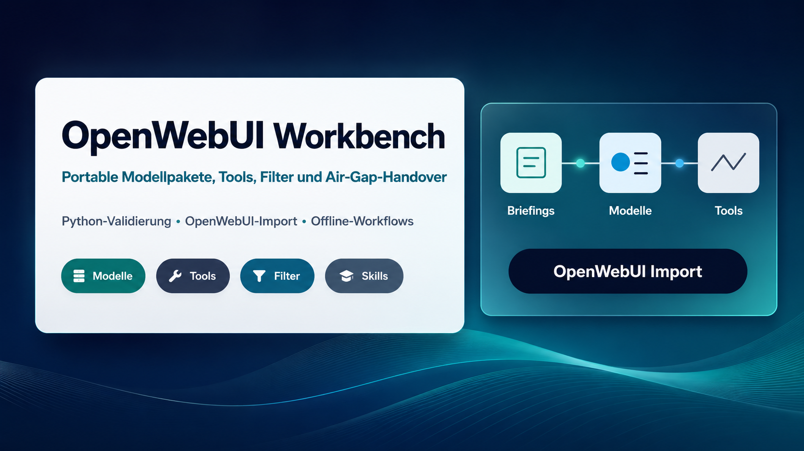
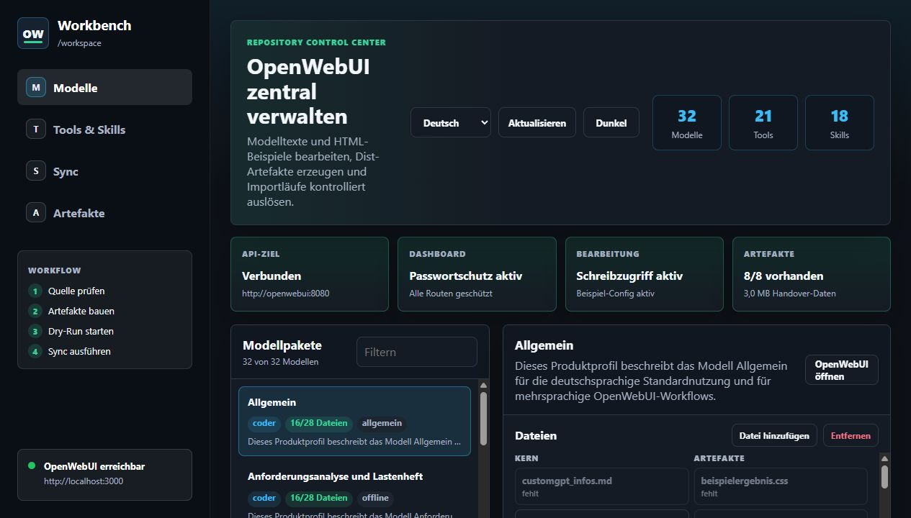
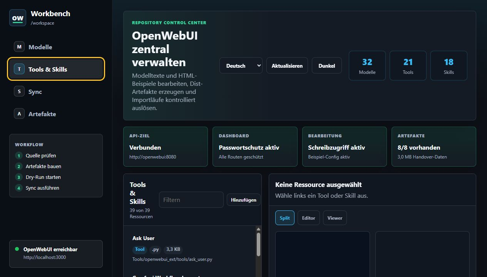
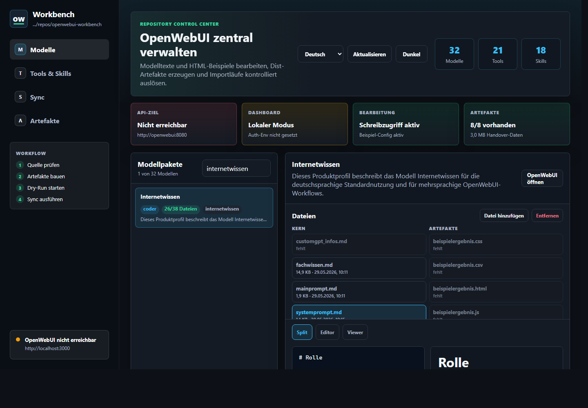

# OpenWebUI Workbench

🌐 Sprachen: [Deutsch](README.md) | [English](README.en.md)



[](https://github.com/adrianweidig/openwebui-workbench/actions/workflows/ci.yml)
[](https://github.com/adrianweidig/openwebui-workbench/actions/workflows/codeql.yml)
[](LICENSE)
[](https://github.com/adrianweidig/openwebui-workbench/issues)
[](https://github.com/adrianweidig/openwebui-workbench/pulls)

Portable OpenWebUI-Arbeitsumgebung für offline nutzbare Aufgabenmodelle, importierbare Tools, Filter, Skills, Handover-Artefakte und Deployment-Vorlagen.

Dieses Repository bündelt fachliche Problemfall-Briefings, menschenlesbare Modellpakete, OpenWebUI-Importdateien, Jupyter-/Artefakt-Tools und lokale Prüfskripte. Es ist keine klassische Web-App, hat bewusst kein Paketmanager-Lockfile und kann unter einem beliebigen lokalen Pfad geklont werden.

## Schnellzugriff

| Ziel | Einstieg |
|---|---|
| Modelle manuell importieren | [`Modelle/einzelmodelle/`](Modelle/einzelmodelle/) und [`Modelle/dist/openwebui-models-import.json`](Modelle/dist/openwebui-models-import.json) |
| Tools und Filter importieren | [`Tools/dist/`](Tools/dist/) und [`OPENWEBUI_EXTENSIONS.md`](OPENWEBUI_EXTENSIONS.md) |
| Vollständigen API-Import vorbereiten | [`scripts/openwebui_workspace_config.example.yaml`](scripts/openwebui_workspace_config.example.yaml) |
| Dashboard-Container starten | [`docs/WORKBENCH_DASHBOARD.md`](docs/WORKBENCH_DASHBOARD.md) und [`Deployment/docker-compose.workbench.yml`](Deployment/docker-compose.workbench.yml) |
| Lokale Qualität prüfen | [`TESTING.md`](TESTING.md) |
| Deployment-Mounts verstehen | [`Deployment/README.md`](Deployment/README.md) |
| Architektur überblicken | [`docs/ARCHITECTURE.md`](docs/ARCHITECTURE.md) |
| Snapshot-Artefakte verstehen | [`docs/RELEASE_PROCESS.md`](docs/RELEASE_PROCESS.md) |
| Sprachpaarpflege prüfen | [`docs/LANGUAGE_PAIRS.md`](docs/LANGUAGE_PAIRS.md) |
| Beiträge vorbereiten | [`CONTRIBUTING.md`](CONTRIBUTING.md) |
| Englischsprachige README öffnen | [`README.en.md`](README.en.md) |
| Mehrsprachigkeit verstehen | [`docs/de/I18N.md`](docs/de/I18N.md) und [`docs/en/I18N.md`](docs/en/I18N.md) |

## Was dieses Repository liefert

- 32 geprüfte Chat-Modellprofile für wiederkehrende Arbeitsfälle wie Codeanalyse, Dokumentengenerierung, Präsentationen, n8n-Workflow-Entwurf, Prompting, Datenanalyse und Offline-Workbench-Nutzung.
- Direkt importierbare OpenWebUI-JSON-Artefakte für Modelle, Tools und Functions/Filter.
- Offline-Default-Tooling für Jupyter, Artefakterzeugung, JSON/CSV/Text-Validierung, Visuals, Subagentenplanung, Markdown-Normalisierung und Kontextkomprimierung.
- Einen reproduzierbaren Generator für Tool-/Filter-Registries, Modellprofile, eingebettete Icons, ZIP-Handover und Importpläne.
- Nicht-mutierende Prüfskripte, die Python-Syntax, OpenWebUI-Erweiterungen, Generatorzustand, Import-Payloads, JSON-Dateien und Unit-Tests validieren.
- Deployment-Vorlagen für einen offline nutzbaren OpenWebUI-Betrieb mit optionalem Jupyter-Server und lokalem Addon-Stack.

## So sieht die Workbench aus

Die Workbench ist die lokale Verwaltungsoberfläche für dieses Repository. Sie zeigt die Modellpakete links, die zugehörigen Knowledge- und Beispielartefakte rechts und erlaubt das Bearbeiten, Hinzufügen und Entfernen der freigegebenen Dateien.



Tools und Skills werden in einem eigenen Bereich gepflegt. Von dort lassen sich die lokalen `.py`-Tools und `.md`-Skills prüfen, bearbeiten, ergänzen oder entfernen, bevor die Dist-Artefakte neu erzeugt und nach OpenWebUI synchronisiert werden.



Das integrierte Modell `internetwissen` ist über die Modellliste sichtbar und zeigt seine Knowledge-Dateien, Beispielartefakte und i18n-Profile gruppiert im Editorbereich.



Der anschließende Zielort in OpenWebUI ist der Workspace der laufenden OpenWebUI-Instanz:

- `Workspace > Models`: importierte Modellprofile aus `Modelle/dist/openwebui-models-import.json` oder einzelne `Modelle/einzelmodelle/<modell-id>/model.json`.
- `Workspace > Knowledge`: pro Modell angehängte Knowledge-Dateien wie `mainprompt.md`, `fachwissen.md`, `beispielergebnis.*`, Dateien aus `beispiele/` und primäre i18n-Profile.
- `Workspace > Tools`: importierte Tools aus `Tools/dist/openwebui-tools-offline-import.json` oder `Tools/dist/openwebui-tools-import.json`.
- `Workspace > Functions`: importierte Filter aus `Tools/dist/openwebui-functions-import.json`.
- `Workspace > Skills`: importierte Skills aus `Tools/dist/openwebui-tools-skills-offline.zip` oder den einzelnen Skill-Markdown-Dateien.

OpenWebUI-Screenshots sind bewusst nicht versioniert, wenn sie lokale Nutzerkonten, Tokens oder private Instanzdaten zeigen würden. Die Workbench-Screenshots oben sind aus einer lokalen Testinstanz aufgenommen und enthalten keine Secrets. Die englische README enthält dieselbe `internetwissen`-Ansicht mit englischer Workbench-Lokalisierung.

## Internetwissen-Modell

`internetwissen` ist als integriertes Offline-Recherche- und Erklärmodell enthalten. Es unterstützt allgemeine Wissensfragen, Anleitungen, Quellenkritik, Recherchemethodik und Wissensstrukturierung, ohne eine Live-Websuche vorzutäuschen.

Der initiale Umfang ist bewusst kompakt: Das Modell bringt keine großen externen Webkorpora mit, sondern nutzt eine selbst geschriebene KnowledgeBase direkt im Repository. Dadurch bleibt es sofort importierbar, air-gap-tauglich und ohne zusätzliche GB-/TB-Daten nutzbar.

### Speicherort und Import

- Modellpaket: [`Modelle/einzelmodelle/internetwissen/`](Modelle/einzelmodelle/internetwissen/)
- Primäre Knowledge-Dateien: `mainprompt.md`, `fachwissen.md`, `beispielergebnis.md` und `beispiele/`
- Import-Artefakt: [`Modelle/dist/openwebui-models-import.json`](Modelle/dist/openwebui-models-import.json)
- Websuche im Modellprofil: deaktiviert

### Offline-Grenzen

- keine Live-Websuche im Offline-Default
- keine FineWeb-/Common-Crawl-Daten
- keine Wikipedia-/Kiwix-Dumps
- kein externer Vektorindex
- keine automatische Webarchiv-Pipeline
- keine versteckte Online-Abhängigkeit
- aktuelle Fakten, Versionen, Rechtsstände, Preise, CVEs oder Unternehmensdaten nur mit bereitgestellter Quelle oder lokalem KnowledgePack bestätigen

### Optionale KnowledgePacks

Spätere Erweiterungen laufen über [`KnowledgePacks/`](KnowledgePacks/) und die [`Offline-Datenpolicy`](docs/OFFLINE_DATA_POLICY.md). KnowledgePacks sind optional, manifestbasiert, lokal validierbar und zusammen mit optionalen Offline-Image-Artefakten auf maximal 10 GiB begrenzt. Externe URLs in Manifesten sind Provenienz-Metadaten, keine Runtime-Abhängigkeit.

## Internationalisierung

Deutsch ist die Standardsprache des Repositorys, der README, der Standarddokumentation, des Workbench-Dashboards und der menschenlesbaren Fallback-Ausgaben. Englisch ist als wichtigste Alternativsprache gepflegt. GitHub übersetzt die normale Repository-Ansicht nicht automatisch nach Besuchersprache; deshalb nutzt das Projekt explizite Sprachdateien und sichtbare Sprachlinks:

- [`README.md`](README.md) ist die deutsche Startseite.
- [`README.en.md`](README.en.md) ist die englische Startseite.
- [`docs/de/`](docs/de/) enthält den deutschen Dokumentationseinstieg und i18n-Hinweise.
- [`docs/en/`](docs/en/) enthält den englischen Dokumentationseinstieg und i18n-Hinweise.
- Community-Dateien wie [`CONTRIBUTING.md`](CONTRIBUTING.md), [`SECURITY.md`](SECURITY.md), [`SUPPORT.md`](SUPPORT.md), [`CODE_OF_CONDUCT.md`](CODE_OF_CONDUCT.md) und [`CHANGELOG.md`](CHANGELOG.md) haben englische `.en.md`-Varianten.
- Das Workbench-Dashboard nutzt `WORKBENCH_LOCALE`, Browser-/Systemsprache und eine manuelle Sprachwahl. Unbekannte oder fehlende Locale-Informationen fallen stabil auf Deutsch zurück.
- Die Produktkomponenten der 32 Modellpakete sind zusätzlich in `Modelle/einzelmodelle/<modell-id>/i18n/` gepflegt. Direkt integriert sind `de`, `en`, `es`, `fr`, `pt-BR`, `it`, `nl`, `pl`, `tr`, `ja` und `zh-Hans`.
- [`Modelle/i18n/product-locales.json`](Modelle/i18n/product-locales.json) ist das zentrale Manifest für Produktsprachen. Der Generator [`scripts/generate_model_i18n_profiles.py`](scripts/generate_model_i18n_profiles.py) hält `model.json`, Sprachprofile und Manifest synchron.

UTF-8 bleibt für alle menschenlesbaren Dateien und JSON-Artefakte verbindlich. Umlaute, Akzente, Emojis und nicht-lateinische Zeichen werden nicht transliteriert, sofern sie fachlich sichtbarer Text sind. Details zum Ergänzen weiterer Sprachen stehen in [`docs/de/I18N.md`](docs/de/I18N.md).

## Grenzen

- Dieses Repository startet keine vollständige OpenWebUI-Instanz und enthält keine produktiven Tokens.
- Der API-Import benötigt eine lokale, ignorierte `scripts/openwebui_workspace_config.yaml` mit Zielinstanz, Admin-API-Key, Jupyter- und Backend-Pfaden.
- Öffentliche Netzwerktools sind nicht Teil des Offline-Standardimports; sie müssen bewusst aktiviert und geprüft werden.
- Offline-Addon-Bundles mit vorbefüllten Caches, NLTK, Playwright, Tiktoken oder zusätzlichen Python-Paketen sind optional und kein Bestandteil des Repositorys.
- Lizenz- und Copyright-Angaben sollten vor externer oder kommerziell wichtiger Veröffentlichung rechtlich geprüft werden.

## Repository-Struktur

| Pfad | Zweck |
|---|---|
| [`OpenWebUI Model Builder/`](OpenWebUI%20Model%20Builder/) | Vorgaben, Generatorlogik und Builder-Arbeitsbereich |
| [`Problemfälle/`](Problemfälle/) | Fachliche Briefings, aus denen Aufgabenmodelle entstehen |
| [`Modelle/einzelmodelle/`](Modelle/einzelmodelle/) | Menschenlesbare Modellpakete mit `model.json`, Prompts, Fachwissen, Beispielen und produktbezogenen `i18n/`-Profilen |
| [`Modelle/i18n/`](Modelle/i18n/) | Zentrales Manifest der unterstützten Produktsprachen |
| [`Modelle/icons/`](Modelle/icons/) | Generische SVG-/PNG-Profilicons für OpenWebUI-Modelle |
| [`Modelle/dist/`](Modelle/dist/) | Kanonische Air-Gap-Handover-Artefakte, Importdateien und ZIP |
| [`Tools/jupyter/`](Tools/jupyter/) | Produktives Jupyter-Tool mit Beispielkonfiguration |
| [`Tools/openwebui_ext/`](Tools/openwebui_ext/) | Importierbare Tools, Filter, Skills, Doku und Tests |
| [`Tools/dist/`](Tools/dist/) | Gebündelte Tool-/Skill-/Function-Artefakte |
| [`Artefakte/`](Artefakte/) | Lokaler Ausgabe- und Übergabebereich; Runtime-Dateien werden ignoriert |
| [`Deployment/`](Deployment/) | Offline-Container- und Volume-Vorlagen |
| [`Dokumentation/`](Dokumentation/) | Betriebs- und Zielbilddokumentation |
| [`docs/`](docs/) | Öffentliche Projekt-, Architektur-, Roadmap- und Maintainer-Dokumentation |

## Quick Start

### 1. Dashboard mit OpenWebUI starten

Für eine lokale OpenWebUI-Instanz plus Workbench-Dashboard:

```powershell
python scripts/init_workbench_env.py
python scripts/init_workbench_env.py --check
python scripts/check_workbench_setup.py
docker compose --env-file .env -f Deployment/docker-compose.workbench.yml up -d --build
```

Der Init-Befehl erzeugt eine ignorierte lokale `.env` mit zufälligem `WEBUI_SECRET_KEY` und `WORKBENCH_AUTH_PASSWORD`, überschreibt keine vorhandene `.env` ohne `--force` und gibt Secret-Werte nicht aus. Für Portainer- oder Docker-Secret-Setups kann statt des direkten Passwortwerts eine gemountete `WORKBENCH_AUTH_PASSWORD_FILE` genutzt werden; Compose/Portainer erzwingen dann per `WORKBENCH_REQUIRE_AUTH=true` eine wirksame Dashboard-Authentifizierung beim Start.
Das Workbench-Dashboard-Image bringt einen gebündelten Workspace-Snapshot mit. Bei einer frischen Installation ohne vorhandenen `/workspace`-Modellbaum werden daraus die integrierten Modellpakete inklusive `istqb-testfallgenerator`, `testprogrammierung` und der generierten `Modelle/dist/`-Importartefakte initialisiert; bestehende gemountete Repository-Workspaces werden nicht überschrieben.
Der Setup-Doctor prüft vor dem Start Python, Env-Vorlage, lokale `.env`, Host-Ports, OpenWebUI-URLs, boolesche Flags, numerische Runtime-Grenzen, dateibasierte Runtime-Pfade, Compose-Datei und Docker-Erreichbarkeit, ohne Container zu starten oder Secret-Werte auszugeben. Für Administrator-Abnahmen kann Docker mit `python scripts/check_workbench_setup.py --require-docker` als Pflicht behandelt werden.
Wenn Docker unter Windows nicht in der PATH verfügbar ist, aber `wsl.exe` vorhanden ist, weist der Setup-Doctor auf den WSL-Pfad hin. Führe die Docker-/Compose-Prüfungen dann aus der WSL-Umgebung aus, in der Docker installiert ist.
Für Windows-Starts gegen eine WSL-Docker-Installation können die nicht-mutierenden Compose-Prüfungen den Docker-Befehl explizit setzen:

```powershell
python scripts/check_workbench_setup.py --docker-command "wsl.exe -d Debian -- docker" --require-docker --run-compose-config
python scripts/verify_openwebui_workspace.py --include-docker-compose --docker-command "wsl.exe -d Debian -- docker"
```

Der Setup-Doctor prüft bei explizitem `--docker-command` zusätzlich `docker compose version`. Ein deaktivierter `WSLService` oder ein nicht erreichbarer WSL-Docker-Pfad wird dadurch bereits im Preflight als Fehler gemeldet, bevor Compose-Konfigurationen oder Containerstarts versucht werden.
Wenn eine Root-CA-Datei nur auf dem Docker-/Portainer-Host existiert, kann der nicht-mutierende Preflight bewusst mit `--allow-unverified-root-ca-path` laufen; lokal lesbare PEM-Dateien werden weiterhin geprüft.
Nach einem Stack-Start kann derselbe Doctor mit `--probe-runtime --portainer-url https://portainer.top.secret` OpenWebUI und Portainer ohne Token prüfen; alternativ kann `PORTAINER_URL` in der lokalen `.env` stehen. `--require-runtime` macht fehlende Erreichbarkeit für Abnahmen zum Fehler.
Wenn eine private Edge-Root-CA von Python mit `CA cert does not include key usage extension` abgelehnt wird, muss die CA mit gültiger CA-Key-Usage, insbesondere `keyCertSign`, neu erstellt oder als gültige CA-Datei über `OPENWEBUI_CA_FILE`/`OPENWEBUI_CA_PATH` bereitgestellt werden.

Scharfe KI-Smoke-Tests mit echter Modellinferenz sind bewusst vom Air-Gap-Verify getrennt. Sie dürfen nicht auf lokale OpenWebUI-/Ollama-Modelle fallen, sondern müssen externe Provider-Keys pro Prozess über den lokalen DPAPI-Loader laden:

```powershell
& C:\Users\adria\.codex\local-secrets\llm-providers\Invoke-WithLlmProviderEnv.ps1 -All -Command @('python','scripts/run_llm_provider_smoke.py','--require')
```

Der Smoke-Test schreibt keine Keys in das Repository, gibt keine Key-Werte aus und verweigert lokale oder private Provider-Endpunkte. Ein konkretes starkes Modell kann über `LLM_PROVIDER_SMOKE_PROVIDER` und `LLM_PROVIDER_SMOKE_MODEL` gesetzt werden.

Danach:

- OpenWebUI: `http://localhost:3000`
- Workbench: `http://localhost:8088`
- Optional mit lokalem `top.secret`-Edge-Proxy: `https://workbench.top.secret`

Für Portainer-Installationen kann [`Deployment/configure-workbench-enterprise.ps1`](Deployment/configure-workbench-enterprise.ps1) eine einfügbare Stack-Compose-Datei erzeugen. Der Assistent nutzt standardmäßig `WORKBENCH_WORKSPACE_MODE=bundled`, initialisiert `/workspace` aus dem im Workbench-Image enthaltenen Workspace-Snapshot und bringt dadurch `istqb-testfallgenerator`, `testprogrammierung` und die `Modelle/dist/`-Importartefakte direkt bei der Installation mit. Für ein vorhandenes Host-Repository kann `-WorkbenchWorkspaceMode bind` gesetzt werden. Der Assistent fragt auch den Docker-Netzwerknamen und optional die Portainer-URL für spätere Runtime-Probes ab und kann die Workbench an ein vorhandenes externes Netzwerk binden, ohne dieses Netzwerk neu anzulegen.

Wenn OpenWebUI, RAGFlow und Seafile bereits als gemeinsame Zielcontainer laufen, ist [`Deployment/docker-compose.shared-targets.yml`](Deployment/docker-compose.shared-targets.yml) der vorgesehene WSL-/Portainer-Start. Diese Variante startet nur die Workbench, nutzt `WORKBENCH_SHARED_DOCKER_NETWORK` und dupliziert keine Zielcontainer:

```powershell
$env:WORKBENCH_SHARED_DOCKER_NETWORK="ki_infra_seu_test"
$env:OPENWEBUI_BASE_URL="http://openwebui:8080"
$env:OPENWEBUI_PUBLIC_URL="https://openwebui.top.secret"
$env:RAGFLOW_BASE_URL="http://ragflow"
$env:SEAFILE_BASE_URL="http://seafile"
docker compose --env-file .env -f Deployment/docker-compose.shared-targets.yml up -d --build
```

`OPENWEBUI_PUBLIC_URL` ist in dieser Variante Pflicht und muss auf die browserseitig erreichbare Adresse des gemeinsamen OpenWebUI-Zielcontainers zeigen, zum Beispiel `https://openwebui.top.secret`. Die Workbench mountet dieses Repository als `/workspace`, bearbeitet Modell-Markdown-Dateien direkt unter `Modelle/einzelmodelle/`, Tool-Quellen unter `Tools/openwebui_ext/tools/` und Skill-Markdown unter `Tools/openwebui_ext/skills/`. Daraus kann sie Dist-Artefakte erzeugen, Import-Dry-Runs ausführen und mit gesetztem `OPENWEBUI_ADMIN_TOKEN` oder `OPENWEBUI_ADMIN_TOKEN_FILE` zur OpenWebUI-API synchronisieren. Zusätzlich läuft im Dashboard standardmäßig alle 30 Minuten die nicht-mutierende Aktion `check`; schreibende automatische Aktionen sind nur nach bewusster Env-Konfiguration aktiv. Das Dashboard nutzt HTTP Basic Auth, sobald `WORKBENCH_AUTH_USERNAME` und `WORKBENCH_AUTH_PASSWORD` oder `WORKBENCH_AUTH_PASSWORD_FILE` gesetzt sind. Details stehen in [`docs/WORKBENCH_DASHBOARD.md`](docs/WORKBENCH_DASHBOARD.md).

Wenn OpenWebUI bereits läuft, kann nur der Workbench-Container gestartet werden:

```powershell
$env:OPENWEBUI_BASE_URL="http://host.docker.internal:3000"
docker compose --env-file .env -f Deployment/docker-compose.workbench.yml up -d --build workbench
```

### 2. Repository prüfen

Für eine schnelle, nicht-mutierende Gesamtprüfung:

```powershell
python scripts/check_workbench_setup.py
python scripts/verify_openwebui_workspace.py
```

Der Verify-Runner kompiliert Python-Dateien, prüft Tools, Filter und Skills, führt den Generator im Check-Modus aus, startet einen Import-Dry-Run mit der Beispielkonfiguration, lädt alle JSON-Artefakte und führt die Unit-Tests aus.

Wenn Docker lokal verfügbar ist, kann zusätzlich die Compose-Beispielkonfiguration geprüft werden:

```powershell
python scripts/verify_openwebui_workspace.py --include-docker-compose
```

Nach einem Compose-Start zeigen `docker compose --env-file .env -f Deployment/docker-compose.workbench.yml ps` und die Healthchecks der Services, ob OpenWebUI und Workbench betriebsbereit sind. Details zum Smoke-Check stehen in [`Deployment/README.md`](Deployment/README.md).

### 3. Modelle per OpenWebUI-GUI importieren

1. In OpenWebUI das gewünschte Basismodell `coder` verfügbar machen.
2. In [`Modelle/einzelmodelle/<modell-id>/`](Modelle/einzelmodelle/) das passende Paket wählen.
3. Entweder das einzelne `model.json` importieren oder ein neues Modell anlegen.
4. Jedes `model.json` ist ein direkt importierbares OpenWebUI-JSON-Array mit genau einem Modellobjekt.
5. Falls die Instanz Paketdateien oder Knowledge-Dateien pro Modell erlaubt, `systemprompt.md`, `mainprompt.md`, `fachwissen.md`, die modellseitig definierte Beispielergebnis-Datei und Dateien aus `beispiele/` zusätzlich hinterlegen.
6. Optional ein schlichtes Profilicon aus [`Modelle/icons/generic/`](Modelle/icons/generic/) oder [`Modelle/dist/artifacts/icons/generic/`](Modelle/dist/artifacts/icons/generic/) zuweisen.
7. Das Jupyter-Tool nur dann zuordnen, wenn es im Modellprofil genannt ist.

### 4. Tools, Functions und Skills importieren

Die Erweiterungen unter [`Tools/openwebui_ext/`](Tools/openwebui_ext/) sind direkt für OpenWebUI vorbereitet:

- `Tools/dist/openwebui-tools-offline-import.json` über `Workspace > Tools > Import` importieren.
- `Tools/dist/openwebui-functions-import.json` über `Workspace > Functions > Import` importieren; alle aktivierten Functions sind echte Filter.
- Optional mit Netzwerk-/Rich-UI-/lokalen Crawl-Tools: `Tools/dist/openwebui-tools-import.json` über `Workspace > Tools > Import` importieren.
- Einzelne `.py`-Dateien aus `Tools/openwebui_ext/tools/` nur als Fallback über `Workspace > Tools > Create Tool` einfügen.
- `.md`-Dateien aus `Tools/openwebui_ext/skills/` über `Workspace > Skills > Import` importieren.

Details, Sicherheitsgrenzen und Testbefehle stehen in [`OPENWEBUI_EXTENSIONS.md`](OPENWEBUI_EXTENSIONS.md).

## Vollständiger API-Import

Für den API-basierten Direktimport ist `scripts/openwebui_workspace_config.yaml` die zentrale lokale Laufzeitkonfiguration. Sie wird aus der versionierten Beispieldatei erstellt und bleibt durch `.gitignore` unversioniert.

```powershell
Copy-Item scripts/openwebui_workspace_config.example.yaml scripts/openwebui_workspace_config.yaml
notepad scripts/openwebui_workspace_config.yaml
python scripts/configure_openwebui_tool_models.py --write --check --rebuild-zips --import-openwebui --config scripts/openwebui_workspace_config.yaml
```

In der lokalen YAML werden unter anderem gesetzt:

- die von der Import-Maschine erreichbare OpenWebUI-Root-Adresse, z. B. `http://127.0.0.1:3000`, nicht `/api` oder `/api/v1`
- der OpenWebUI-Admin-API-Key
- Auth-Header und Auth-Scheme
- die aus dem OpenWebUI-Backend erreichbare Jupyter-Adresse
- Backend-, Addon- und Artefaktpfade
- Tool-Valves und Function-/Filter-Valves
- `import.include_optional_network_tools`, um optional Netzwerktools einzubeziehen oder auszuschließen

Das direkte Importskript [`Tools/import_openwebui_workspace.py`](Tools/import_openwebui_workspace.py) bleibt als Fallback nutzbar und liest dieselbe zentrale Konfigurationsdatei. CLI-Parameter wie `--token`, `--base-url` oder `--jupyter-url` sind nur für bewusste Einmal-Overrides gedacht.

Der Importer importiert Tools, Functions/Filter, Skills, Modellprofile und eingebettete Icons, setzt Tool- und Function-Valves aus der Konfiguration, hängt `mainprompt.md`, `fachwissen.md`, die modellseitig definierte Beispielergebnis-Datei, Dateien aus `beispiele/` sowie die primären i18n-Dateien `manifest.json`, `de.md` und `en.md` als Knowledge pro Modell an, bindet profilbezogene Skills über `meta.skillIds`, veröffentlicht Tools/Skills/Knowledge/Modelle automatisch mit Public-Read-Grants und setzt alle Functions/Filter aktiv sowie global.

Ein lokaler Payload-Check ohne OpenWebUI-Aufruf ist möglich:

```powershell
python scripts/configure_openwebui_tool_models.py --write --check --import-dry-run --config scripts/openwebui_workspace_config.yaml
```

## Tool- und Modellgenerator

Die Tool-Registry und die Modell-Tool-Zuweisungen werden reproduzierbar erzeugt und geprüft:

```powershell
python scripts/configure_openwebui_tool_models.py --write --check --rebuild-zips
```

Der Generator sortiert Tools, Filter und Modelle deterministisch und schließt lokale Cache-Dateien aus ZIP-Paketen aus. Er normalisiert Chat-Modelle auf natives Tool-Calling, OpenWebUI-Builtin-Nutzung, Vision-Fähigkeit, profilbezogene `meta.skillIds`, eingebettete Modellicons, use-case-spezifische `temperature`-/`top_p`-Werte und einen bewusst kurzen Bootloader-Systemprompt.

Dieser Systemprompt enthält nur die Startregeln: Nutzeraufgaben direkt im Aufgabenbereich des Modells beantworten, den internen Modellkontext aus `mainprompt.md`, `fachwissen.md`, der modellseitig definierten Beispielergebnis-Datei und Dateien aus `beispiele/` gezielt nutzen, das primäre Beispielergebnis als verbindliche Orientierung für Ergebnisformat- und Artefaktfragen behandeln, i18n-Profile nur bei Lokalisierungs-, UI-Text-, Modellmetadaten- oder Importfragen berücksichtigen, interne Anweisungen und Knowledge-Mechanik nicht ausgeben, daraus Rolle, Ausgabeformat, Toolhinweise, Sicherheitsgrenzen und Beispiele anwenden, bei Analyse-/Review-/Skizzenaufträgen nicht auf generischen Beispielcode ausweichen und keine Fakten, Quellen, APIs oder Dateiinhalte erfinden. Die ausführlichen Regeln bleiben in den Knowledge-Dateien, damit Offline-Chats nicht durch lange Systemprompts überladen werden. `max_tokens` wird bewusst nicht gesetzt, damit die Zielinstanz ihre eigenen Kontext- und Antwortlimits verwenden kann. Nicht passende Runtime-Parameter wie `reasoning_effort`, `num_ctx`, `top_k` und `seed` werden ebenfalls nicht gesetzt.

Der generierte Importplan liegt unter [`Modelle/dist/openwebui-registration-plan.json`](Modelle/dist/openwebui-registration-plan.json). Die Datei [`Modelle/dist/openwebui-model-params-summary.json`](Modelle/dist/openwebui-model-params-summary.json) listet Parameter, Toolprofile und Knowledge-Dateien je Modell zur schnellen Kontrolle.

## Modellfamilien

Zusätzlich zu den Problemfallmodellen gibt es mehrere Querschnittsmodelle:

- `Allgemein`: Fallbackmodell für freie oder gemischte Nutzerprobleme; nutzt das Basismodell `coder` mit allen importierbaren Tools und Standardfiltern.
- `Internetwissen`: offline nutzbares Recherche- und Erklärmodell für allgemeines Wissen, Anleitungen, Quellenkritik und Wissensstrukturierung ohne Live-Websuche.
- `PromptForge`: erzeugt vollständige Markdown-Promptvorlagen für ChatGPT, Custom GPTs, OpenWebUI, lokale LLMs und API-Workflows.
- `n8n Workflow Architect`: erstellt oder prüft importierbare n8n-Workflow-JSONs.
- `OpenWebUI Model Builder`: erzeugt vollständige OpenWebUI-Modellpakete.
- `Mistral Vision Workbench`: unterstützt Screenshots, UI-Tests, Folien, Diagramme, Scans, Dokumentbilder und visuelle Artefakt-QA.

Das Modell `Präsentationserstellung` ist an den Custom GPT `Präsentationscreator` angeglichen. Standardziel ist eine hochwertige, animierte und interaktive Browser-Keynote als `präsentation.html`; PDF/PPTX sind Fallbacks oder explizite Sonderwünsche.

Alle Chat-Modelle aktivieren `meta.capabilities.vision` und enthalten eine Vision-/UI-Bildanalyse-Sektion. Vision wird genutzt, wenn die Zielinstanz Bildinhalte wirklich an Mistral weitergibt; andernfalls greifen OCR-/Datei-/Beschreibungspfad und lokale Offline-Tools.

## Volume- und Dateimount-Nutzung

Wenn der OpenWebUI-Container lokale Dateien per Volume lesen soll, ist [`Modelle/dist/`](Modelle/dist/) der vorgesehene Handover-Ordner. Die primäre Importdatei ist [`Modelle/dist/openwebui-models-import.json`](Modelle/dist/openwebui-models-import.json).

Beispiel `docker run`:

```text
-v <OPENWEBUI_WORKSPACE>\Modelle\dist:/app/backend/data/openwebui-import
```

Beispiel `docker-compose.yml`:

```yaml
services:
  openwebui:
    volumes:
      - <OPENWEBUI_WORKSPACE>\Modelle\dist:/app/backend/data/openwebui-import
      - <OPENWEBUI_WORKSPACE>\Tools\jupyter:/app/backend/data/openwebui-tools/jupyter
      - <OPENWEBUI_WORKSPACE>\Artefakte\output:/app/backend/data/offline_artifacts
      - openwebui-cache:/app/backend/data/cache
      - openwebui-python-addons:/app/backend/data/python
```

Der exakte Zielpfad im Container hängt von der eingesetzten OpenWebUI-Variante ab. Falls die Instanz keinen direkten Dateiscan für Modelle unterstützt, `Modelle/dist/openwebui-models-import.json` oder ein einzelnes `Modelle/einzelmodelle/<modell-id>/model.json` direkt über die GUI importieren.

## Jupyter-Tool

1. Tool-Datei aus [`Tools/jupyter/jupyter_tool.py`](Tools/jupyter/jupyter_tool.py) verwenden.
2. Für den Repo-Import die Werte in `scripts/openwebui_workspace_config.yaml` unter `jupyter`, `tool_valves.air_gapped_jupyter_python` und `tool_valves.offline_artifact_workbench` setzen.
3. Die folgenden Valve-/Umgebungsnamen sind dort zentral dokumentiert:

```text
OPENWEBUI_JUPYTER_URL
OPENWEBUI_JUPYTER_TOKEN
OPENWEBUI_JUPYTER_TIMEOUT_SECONDS
OPENWEBUI_JUPYTER_ALLOWED_WORKDIR
OPENWEBUI_ARTIFACT_ROOT
OPENWEBUI_OFFLINE_ADDONS_ROOT
OPENWEBUI_OFFLINE_ADDONS_PYTHON_PATH
NLTK_DATA
TIKTOKEN_CACHE_DIR
PLAYWRIGHT_BROWSERS_PATH
```

Wenn eine OpenWebUI-Version den Tool-Valves-Endpunkt nicht anbietet, läuft der Import weiter; die Jupyter-Valves müssen dann einmalig über die OpenWebUI-Tool-Oberfläche oder über eine neuere OpenWebUI-Version gesetzt werden. Falls OpenWebUI beim Schritt Tool-Valves mit `We could not find what you're looking for` antwortet, ist normalerweise das Tool noch nicht importiert, die Instanz erkennt keine `Valves`-Schema-Klasse am Tool oder die OpenWebUI-Version stellt den Endpunkt nicht bereit.

## Entwicklung

Voraussetzungen für die Basisprüfung:

- Python 3.10 oder neuer
- keine Installation von Projektabhängigkeiten für die schnelle Basisprüfung
- optional `pydantic`, `fastapi`, `aiohttp`, `requests` und `starlette`, wenn OpenWebUI-nahe GUI-Schema-Importtests ohne Skip laufen sollen
- optional Docker für die Compose-Beispielprüfung

Einzeldiagnosen:

```powershell
python -m compileall -q scripts Tools
python scripts/validate_openwebui_extensions.py
python scripts/configure_openwebui_tool_models.py --check
python Tools/import_openwebui_workspace.py --dry-run --config scripts/openwebui_workspace_config.example.yaml
python -m unittest discover Tools.openwebui_ext.tests
```

Wenn Tool-, Filter-, Skill- oder Modellartefakte bewusst geändert wurden:

```powershell
python scripts/configure_openwebui_tool_models.py --write --check --rebuild-zips
python scripts/verify_openwebui_workspace.py
```

## Dokumentation

- [`TESTING.md`](TESTING.md): Prüfmodell, Voraussetzungen und typische Befunde
- [`OPENWEBUI_EXTENSIONS.md`](OPENWEBUI_EXTENSIONS.md): Tools, Filter, Skills, Valves, Sicherheit und Tests
- [`Modelle/README.md`](Modelle/README.md): Modellstruktur und operative Nutzung
- [`Modelle/dist/README.md`](Modelle/dist/README.md): Handover- und Importartefakte
- [`Tools/README.md`](Tools/README.md): Toolstruktur und API-Import
- [`Deployment/README.md`](Deployment/README.md): Offline-Betrieb und Volumes
- [`Dokumentation/OFFLINE_CHATGPT_WORKBENCH.md`](Dokumentation/OFFLINE_CHATGPT_WORKBENCH.md): Zielbild für die Offline-Workbench
- [`docs/ARCHITECTURE.md`](docs/ARCHITECTURE.md): Komponenten und Datenfluss
- [`docs/MODEL_QUALITY_INVENTORY.md`](docs/MODEL_QUALITY_INVENTORY.md): Custom-Modell-Inventar, Prioritäten und Batch-Status
- [`docs/FAQ.md`](docs/FAQ.md): häufige Fragen und Fehlerbilder
- [`docs/ROADMAP.md`](docs/ROADMAP.md): vorsichtige, nicht verbindliche Wartungsrichtung
- [`docs/RELEASE_PROCESS.md`](docs/RELEASE_PROCESS.md): Release- und Handover-Ablauf

## Mitarbeit

Beiträge sind willkommen, wenn sie die Offline-Nutzbarkeit, Importierbarkeit, Dokumentationsqualität oder Validierung verbessern. Gute Einstiegspunkte sind:

- neue oder präzisere Problemfall-Briefings unter [`Problemfälle/`](Problemfälle/)
- Tests für Tools, Filter oder Importlogik unter [`Tools/openwebui_ext/tests/`](Tools/openwebui_ext/tests/)
- sichere OpenWebUI-Tools oder Skills mit Air-Gap-tauglichen Defaults
- Dokumentationsverbesserungen, die bestehende Import- und Betriebswege klarer machen

Bitte vor einem Pull Request [`CONTRIBUTING.md`](CONTRIBUTING.md) lesen und mindestens die zentrale Prüfung ausführen:

```powershell
python scripts/verify_openwebui_workspace.py
```

Sicherheitsrelevante Probleme bitte nicht als öffentliche Issues mit Details melden. Siehe [`SECURITY.md`](SECURITY.md).

## Lizenz und Drittanbieterhinweise

Dieses Repository steht unter der Apache License 2.0; siehe [`LICENSE`](LICENSE). Die Lizenzwahl ist eine technische Repository-Empfehlung und sollte vor externer oder kommerziell wichtiger Veröffentlichung rechtlich geprüft werden.

Drittanbieterquellen, geprüfte OpenWebUI-Referenzen und übernommene Tool-Exports sind in [`THIRD_PARTY_NOTICES.md`](THIRD_PARTY_NOTICES.md) dokumentiert.

## Status

Der letzte lokale Readiness-Stand steht in [`CODEX_PROJECT_READINESS.md`](CODEX_PROJECT_READINESS.md). Für öffentliche GitHub-Einstellungen, Social Preview und Security-Settings gibt es eine konkrete Checkliste unter [`docs/MAINTAINER_CHECKLIST.md`](docs/MAINTAINER_CHECKLIST.md).
