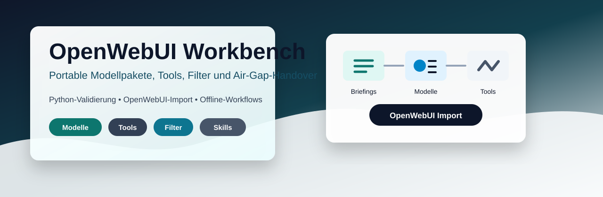

# OpenWebUI Workbench



[](https://github.com/adrianweidig/openwebui-workbench/actions/workflows/ci.yml)
[](https://github.com/adrianweidig/openwebui-workbench/actions/workflows/codeql.yml)
[](LICENSE)
[](https://github.com/adrianweidig/openwebui-workbench/issues)
[](https://github.com/adrianweidig/openwebui-workbench/pulls)

Portable OpenWebUI-Arbeitsumgebung für offline nutzbare Aufgabenmodelle, importierbare Tools, Filter, Skills, Handover-Artefakte und Deployment-Vorlagen.

Dieses Repository bündelt fachliche Problemfall-Briefings, menschenlesbare Modellpakete, OpenWebUI-Importdateien, Jupyter-/Artefakt-Tools und lokale Prüfskripte. Es ist keine klassische Web-App, hat bewusst kein Paketmanager-Lockfile und kann unter einem beliebigen lokalen Pfad geklont werden.

## Schnellzugriff

| Ziel | Einstieg |
|---|---|
| Modelle manuell importieren | [`Modelle/einzelmodelle/`](Modelle/einzelmodelle/) und [`Modelle/dist/openwebui-models-import.json`](Modelle/dist/openwebui-models-import.json) |
| Tools und Filter importieren | [`Tools/dist/`](Tools/dist/) und [`OPENWEBUI_EXTENSIONS.md`](OPENWEBUI_EXTENSIONS.md) |
| Vollständigen API-Import vorbereiten | [`scripts/openwebui_workspace_config.example.yaml`](scripts/openwebui_workspace_config.example.yaml) |
| Lokale Qualität prüfen | [`TESTING.md`](TESTING.md) |
| Deployment-Mounts verstehen | [`Deployment/README.md`](Deployment/README.md) |
| Architektur überblicken | [`docs/ARCHITECTURE.md`](docs/ARCHITECTURE.md) |
| Beiträge vorbereiten | [`CONTRIBUTING.md`](CONTRIBUTING.md) |

## Was dieses Repository liefert

- 31 geprüfte Chat-Modellprofile für wiederkehrende Arbeitsfälle wie Codeanalyse, Dokumentengenerierung, Präsentationen, n8n-Workflow-Entwurf, Prompting, Datenanalyse und Offline-Workbench-Nutzung.
- Direkt importierbare OpenWebUI-JSON-Artefakte für Modelle, Tools und Functions/Filter.
- Offline-Default-Tooling für Jupyter, Artefakterzeugung, JSON/CSV/Text-Validierung, Visuals, Subagentenplanung, Markdown-Normalisierung und Kontextkomprimierung.
- Einen reproduzierbaren Generator für Tool-/Filter-Registries, Modellprofile, eingebettete Icons, ZIP-Handover und Importpläne.
- Nicht-mutierende Prüfskripte, die Python-Syntax, OpenWebUI-Erweiterungen, Generatorzustand, Import-Payloads, JSON-Dateien und Unit-Tests validieren.
- Deployment-Vorlagen für einen offline nutzbaren OpenWebUI-Betrieb mit optionalem Jupyter-Server und lokalem Addon-Stack.

## Grenzen

- Dieses Repository startet keine vollständige OpenWebUI-Instanz und enthält keine produktiven Tokens.
- Der API-Import benötigt eine lokale, ignorierte `scripts/openwebui_workspace_config.yaml` mit Zielinstanz, Admin-API-Key, Jupyter- und Backend-Pfaden.
- Öffentliche Netzwerktools sind nicht Teil des Offline-Standardimports; sie müssen bewusst aktiviert und geprüft werden.
- Der lokale Offline-Addon-Stack `F:\offline-ai-stack\openwebui-offline-addons` ist ein dokumentierter Zielpfad dieser Umgebung, aber kein Bestandteil des Repositorys.
- Lizenz- und Copyright-Angaben sollten vor externer oder kommerziell wichtiger Veröffentlichung rechtlich geprüft werden.

## Repository-Struktur

| Pfad | Zweck |
|---|---|
| [`OpenWebUI Model Builder/`](OpenWebUI%20Model%20Builder/) | Vorgaben, Generatorlogik und Builder-Arbeitsbereich |
| [`Problemfälle/`](Problemfälle/) | Fachliche Briefings, aus denen Aufgabenmodelle entstehen |
| [`Modelle/einzelmodelle/`](Modelle/einzelmodelle/) | Menschenlesbare Modellpakete mit `model.json`, Prompts, Fachwissen und Beispielen |
| [`Modelle/icons/`](Modelle/icons/) | Generische SVG-/PNG-Profilicons für OpenWebUI-Modelle |
| [`Modelle/dist/`](Modelle/dist/) | Kanonische Air-Gap-Handover-Artefakte, Importdateien und ZIP |
| [`Tools/jupyter/`](Tools/jupyter/) | Produktives Jupyter-Tool mit Beispielkonfiguration |
| [`Tools/openwebui_ext/`](Tools/openwebui_ext/) | Importierbare Tools, Filter, Skills, Doku und Tests |
| [`Tools/dist/`](Tools/dist/) | Gebündelte Tool-/Skill-/Function-Artefakte |
| [`Artefakte/`](Artefakte/) | Lokaler Ausgabe- und Übergabebereich; Runtime-Dateien werden ignoriert |
| [`Deployment/`](Deployment/) | Offline-Container- und Volume-Vorlagen |
| [`Dokumentation/`](Dokumentation/) | Betriebs- und Zielbilddokumentation |
| [`docs/`](docs/) | Öffentliche Projekt-, Architektur-, Roadmap- und Maintainer-Dokumentation |

## Quick Start

### 1. Repository prüfen

Für eine schnelle, nicht-mutierende Gesamtprüfung:

```powershell
python scripts/verify_openwebui_workspace.py
```

Der Verify-Runner kompiliert Python-Dateien, prüft Tools, Filter und Skills, führt den Generator im Check-Modus aus, startet einen Import-Dry-Run mit der Beispielkonfiguration, lädt alle JSON-Artefakte und führt die Unit-Tests aus.

Wenn Docker lokal verfügbar ist, kann zusätzlich die Compose-Beispielkonfiguration geprüft werden:

```powershell
python scripts/verify_openwebui_workspace.py --include-docker-compose
```

### 2. Modelle per OpenWebUI-GUI importieren

1. In OpenWebUI das gewünschte Basismodell `coder` verfügbar machen.
2. In [`Modelle/einzelmodelle/<modell-id>/`](Modelle/einzelmodelle/) das passende Paket wählen.
3. Entweder das einzelne `model.json` importieren oder ein neues Modell anlegen.
4. Jedes `model.json` ist ein direkt importierbares OpenWebUI-JSON-Array mit genau einem Modellobjekt.
5. Falls die Instanz Paketdateien oder Knowledge-Dateien pro Modell erlaubt, `systemprompt.md`, `mainprompt.md`, `fachwissen.md`, `beispielergebnis.md` und Dateien aus `beispiele/` zusätzlich hinterlegen.
6. Optional ein schlichtes Profilicon aus [`Modelle/icons/generic/`](Modelle/icons/generic/) oder [`Modelle/dist/artifacts/icons/generic/`](Modelle/dist/artifacts/icons/generic/) zuweisen.
7. Das Jupyter-Tool nur dann zuordnen, wenn es im Modellprofil genannt ist.

### 3. Tools, Functions und Skills importieren

Die Erweiterungen unter [`Tools/openwebui_ext/`](Tools/openwebui_ext/) sind direkt für OpenWebUI vorbereitet:

- `Tools/dist/openwebui-tools-offline-import.json` über `Workspace > Tools > Import` importieren.
- `Tools/dist/openwebui-functions-import.json` über `Workspace > Functions > Import` importieren; alle aktivierten Functions sind echte Filter.
- Optional mit Netzwerk-/Rich-UI-/lokalen Crawl-Tools: `Tools/dist/openwebui-tools-import.json` über `Workspace > Tools > Import` importieren.
- Einzelne `.py`-Dateien aus `Tools/openwebui_ext/tools/` nur als Fallback über `Workspace > Tools > Create Tool` einfügen.
- `.md`-Dateien aus `Tools/openwebui_ext/skills/` über `Workspace > Skills > Import` importieren.

Details, Sicherheitsgrenzen und Testbefehle stehen in [`OPENWEBUI_EXTENSIONS.md`](OPENWEBUI_EXTENSIONS.md).

## Vollständiger API-Import

Für den API-basierten Direktimport ist `scripts/openwebui_workspace_config.yaml` die zentrale lokale Laufzeitkonfiguration. Sie wird aus der versionierten Beispieldatei erstellt und bleibt durch `.gitignore` unversioniert.

```powershell
Copy-Item scripts/openwebui_workspace_config.example.yaml scripts/openwebui_workspace_config.yaml
notepad scripts/openwebui_workspace_config.yaml
python scripts/configure_openwebui_tool_models.py --write --check --rebuild-zips --import-openwebui --config scripts/openwebui_workspace_config.yaml
```

In der lokalen YAML werden unter anderem gesetzt:

- die von der Import-Maschine erreichbare OpenWebUI-Root-Adresse, z. B. `http://127.0.0.1:3000`, nicht `/api` oder `/api/v1`
- der OpenWebUI-Admin-API-Key
- Auth-Header und Auth-Scheme
- die aus dem OpenWebUI-Backend erreichbare Jupyter-Adresse
- Backend-, Addon- und Artefaktpfade
- Tool-Valves und Function-/Filter-Valves
- `import.include_optional_network_tools`, um optional Netzwerktools einzubeziehen oder auszuschließen

Das direkte Importskript [`Tools/import_openwebui_workspace.py`](Tools/import_openwebui_workspace.py) bleibt als Fallback nutzbar und liest dieselbe zentrale Konfigurationsdatei. CLI-Parameter wie `--token`, `--base-url` oder `--jupyter-url` sind nur für bewusste Einmal-Overrides gedacht.

Der Importer importiert Tools, Functions/Filter, Skills, Modellprofile und eingebettete Icons, setzt Tool- und Function-Valves aus der Konfiguration, hängt `mainprompt.md`, `fachwissen.md`, `beispielergebnis.md` sowie Dateien aus `beispiele/` als Knowledge pro Modell an, veröffentlicht Tools/Skills/Knowledge/Modelle automatisch mit Public-Read-Grants und setzt alle Functions/Filter aktiv sowie global.

Ein lokaler Payload-Check ohne OpenWebUI-Aufruf ist möglich:

```powershell
python scripts/configure_openwebui_tool_models.py --write --check --import-dry-run --config scripts/openwebui_workspace_config.yaml
```

## Tool- und Modellgenerator

Die Tool-Registry und die Modell-Tool-Zuweisungen werden reproduzierbar erzeugt und geprüft:

```powershell
python scripts/configure_openwebui_tool_models.py --write --check --rebuild-zips
```

Der Generator sortiert Tools, Filter und Modelle deterministisch und schließt lokale Cache-Dateien aus ZIP-Paketen aus. Er normalisiert Chat-Modelle auf natives Tool-Calling, OpenWebUI-Builtin-Nutzung, Vision-Fähigkeit, eingebettete Modellicons, use-case-spezifische `temperature`-/`top_p`-Werte und einen kurzen Bootstrap-Systemprompt.

Dieser Systemprompt verpflichtet jedes Modell, vor der Antwort `mainprompt.md`, `fachwissen.md`, `beispielergebnis.md` und Dateien aus `beispiele/` als Knowledge zu laden, zu analysieren und für Rolle, Scope, Ausgabeformat, Tool-Nutzung und Qualitätsmaßstab anzuwenden. `max_tokens` wird bewusst nicht gesetzt, damit die Zielinstanz ihre eigenen Kontext- und Antwortlimits verwenden kann. Nicht passende Runtime-Parameter wie `reasoning_effort`, `num_ctx`, `top_k` und `seed` werden ebenfalls nicht gesetzt.

Der generierte Importplan liegt unter [`Modelle/dist/openwebui-registration-plan.json`](Modelle/dist/openwebui-registration-plan.json). Die Datei [`Modelle/dist/openwebui-model-params-summary.json`](Modelle/dist/openwebui-model-params-summary.json) listet Parameter, Toolprofile und Knowledge-Dateien je Modell zur schnellen Kontrolle.

## Modellfamilien

Zusätzlich zu den Problemfallmodellen gibt es mehrere Querschnittsmodelle:

- `Allgemein`: Fallbackmodell für freie oder gemischte Nutzerprobleme; nutzt das Basismodell `coder` mit allen importierbaren Tools und Standardfiltern.
- `PromptForge`: erzeugt vollständige Markdown-Promptvorlagen für ChatGPT, Custom GPTs, OpenWebUI, lokale LLMs und API-Workflows.
- `n8n Workflow Architect`: erstellt oder prüft importierbare n8n-Workflow-JSONs.
- `OpenWebUI Model Builder`: erzeugt vollständige OpenWebUI-Modellpakete.
- `Mistral Vision Workbench`: unterstützt Screenshots, UI-Tests, Folien, Diagramme, Scans, Dokumentbilder und visuelle Artefakt-QA.

Das Modell `Präsentationserstellung` ist an den Custom GPT `Präsentationscreator` angeglichen. Standardziel ist eine hochwertige, animierte und interaktive Browser-Keynote als `präsentation.html`; PDF/PPTX sind Fallbacks oder explizite Sonderwünsche.

Alle Chat-Modelle aktivieren `meta.capabilities.vision` und enthalten eine Vision-/UI-Bildanalyse-Sektion. Vision wird genutzt, wenn die Zielinstanz Bildinhalte wirklich an Mistral weitergibt; andernfalls greifen OCR-/Datei-/Beschreibungspfad und lokale Offline-Tools.

## Volume- und Dateimount-Nutzung

Wenn der OpenWebUI-Container lokale Dateien per Volume lesen soll, ist [`Modelle/dist/`](Modelle/dist/) der vorgesehene Handover-Ordner. Die primäre Importdatei ist [`Modelle/dist/openwebui-models-import.json`](Modelle/dist/openwebui-models-import.json).

Beispiel `docker run`:

```text
-v <OPENWEBUI_WORKSPACE>\Modelle\dist:/app/backend/data/openwebui-import
```

Beispiel `docker-compose.yml`:

```yaml
services:
  openwebui:
    volumes:
      - <OPENWEBUI_WORKSPACE>\Modelle\dist:/app/backend/data/openwebui-import
      - <OPENWEBUI_WORKSPACE>\Tools\jupyter:/app/backend/data/openwebui-tools/jupyter
      - <OPENWEBUI_WORKSPACE>\Artefakte\output:/app/backend/data/offline_artifacts
      - F:\offline-ai-stack\openwebui-offline-addons\cache:/app/backend/data/cache
      - F:\offline-ai-stack\openwebui-offline-addons\nltk_data:/app/backend/data/nltk_data
      - F:\offline-ai-stack\openwebui-offline-addons\python:/app/backend/data/python
```

Der exakte Zielpfad im Container hängt von der eingesetzten OpenWebUI-Variante ab. Falls die Instanz keinen direkten Dateiscan für Modelle unterstützt, `Modelle/dist/openwebui-models-import.json` oder ein einzelnes `Modelle/einzelmodelle/<modell-id>/model.json` direkt über die GUI importieren.

## Jupyter-Tool

1. Tool-Datei aus [`Tools/jupyter/jupyter_tool.py`](Tools/jupyter/jupyter_tool.py) verwenden.
2. Für den Repo-Import die Werte in `scripts/openwebui_workspace_config.yaml` unter `jupyter`, `tool_valves.air_gapped_jupyter_python` und `tool_valves.offline_artifact_workbench` setzen.
3. Die folgenden Valve-/Umgebungsnamen sind dort zentral dokumentiert:

```text
OPENWEBUI_JUPYTER_URL
OPENWEBUI_JUPYTER_TOKEN
OPENWEBUI_JUPYTER_TIMEOUT_SECONDS
OPENWEBUI_JUPYTER_ALLOWED_WORKDIR
OPENWEBUI_ARTIFACT_ROOT
OPENWEBUI_OFFLINE_ADDONS_ROOT
OPENWEBUI_OFFLINE_ADDONS_PYTHON_PATH
NLTK_DATA
TIKTOKEN_CACHE_DIR
PLAYWRIGHT_BROWSERS_PATH
```

Wenn eine OpenWebUI-Version den Tool-Valves-Endpunkt nicht anbietet, läuft der Import weiter; die Jupyter-Valves müssen dann einmalig über die OpenWebUI-Tool-Oberfläche oder über eine neuere OpenWebUI-Version gesetzt werden. Falls OpenWebUI beim Schritt Tool-Valves mit `We could not find what you're looking for` antwortet, ist normalerweise das Tool noch nicht importiert, die Instanz erkennt keine `Valves`-Schema-Klasse am Tool oder die OpenWebUI-Version stellt den Endpunkt nicht bereit.

## Entwicklung

Voraussetzungen für die Basisprüfung:

- Python 3.10 oder neuer
- keine Installation von Projektabhängigkeiten für die schnelle Basisprüfung
- optional `pydantic`, `fastapi`, `aiohttp`, `requests` und `starlette`, wenn OpenWebUI-nahe GUI-Schema-Importtests ohne Skip laufen sollen
- optional Docker für die Compose-Beispielprüfung

Einzeldiagnosen:

```powershell
python -m compileall -q scripts Tools
python scripts/validate_openwebui_extensions.py
python scripts/configure_openwebui_tool_models.py --check
python Tools/import_openwebui_workspace.py --dry-run --config scripts/openwebui_workspace_config.example.yaml
python -m unittest discover Tools.openwebui_ext.tests
```

Wenn Tool-, Filter-, Skill- oder Modellartefakte bewusst geändert wurden:

```powershell
python scripts/configure_openwebui_tool_models.py --write --check --rebuild-zips
python scripts/verify_openwebui_workspace.py
```

## Dokumentation

- [`TESTING.md`](TESTING.md): Prüfmodell, Voraussetzungen und typische Befunde
- [`OPENWEBUI_EXTENSIONS.md`](OPENWEBUI_EXTENSIONS.md): Tools, Filter, Skills, Valves, Sicherheit und Tests
- [`Modelle/README.md`](Modelle/README.md): Modellstruktur und operative Nutzung
- [`Modelle/dist/README.md`](Modelle/dist/README.md): Handover- und Importartefakte
- [`Tools/README.md`](Tools/README.md): Toolstruktur und API-Import
- [`Deployment/README.md`](Deployment/README.md): Offline-Betrieb und Volumes
- [`Dokumentation/OFFLINE_CHATGPT_WORKBENCH.md`](Dokumentation/OFFLINE_CHATGPT_WORKBENCH.md): Zielbild für die Offline-Workbench
- [`docs/ARCHITECTURE.md`](docs/ARCHITECTURE.md): Komponenten und Datenfluss
- [`docs/FAQ.md`](docs/FAQ.md): häufige Fragen und Fehlerbilder
- [`docs/ROADMAP.md`](docs/ROADMAP.md): vorsichtige, nicht verbindliche Wartungsrichtung
- [`docs/RELEASE_PROCESS.md`](docs/RELEASE_PROCESS.md): Release- und Handover-Ablauf

## Mitarbeit

Beiträge sind willkommen, wenn sie die Offline-Nutzbarkeit, Importierbarkeit, Dokumentationsqualität oder Validierung verbessern. Gute Einstiegspunkte sind:

- neue oder präzisere Problemfall-Briefings unter [`Problemfälle/`](Problemfälle/)
- Tests für Tools, Filter oder Importlogik unter [`Tools/openwebui_ext/tests/`](Tools/openwebui_ext/tests/)
- sichere OpenWebUI-Tools oder Skills mit Air-Gap-tauglichen Defaults
- Dokumentationsverbesserungen, die bestehende Import- und Betriebswege klarer machen

Bitte vor einem Pull Request [`CONTRIBUTING.md`](CONTRIBUTING.md) lesen und mindestens die zentrale Prüfung ausführen:

```powershell
python scripts/verify_openwebui_workspace.py
```

Sicherheitsrelevante Probleme bitte nicht als öffentliche Issues mit Details melden. Siehe [`SECURITY.md`](SECURITY.md).

## Lizenz und Drittanbieterhinweise

Dieses Repository steht unter der Apache License 2.0; siehe [`LICENSE`](LICENSE). Die Lizenzwahl ist eine technische Repository-Empfehlung und sollte vor externer oder kommerziell wichtiger Veröffentlichung rechtlich geprüft werden.

Drittanbieterquellen, geprüfte OpenWebUI-Referenzen und übernommene Tool-Exports sind in [`THIRD_PARTY_NOTICES.md`](THIRD_PARTY_NOTICES.md) dokumentiert.

## Status

Der letzte lokale Readiness-Stand steht in [`CODEX_PROJECT_READINESS.md`](CODEX_PROJECT_READINESS.md). Für öffentliche GitHub-Einstellungen, Social Preview und Security-Settings gibt es eine konkrete Checkliste unter [`docs/MAINTAINER_CHECKLIST.md`](docs/MAINTAINER_CHECKLIST.md).
