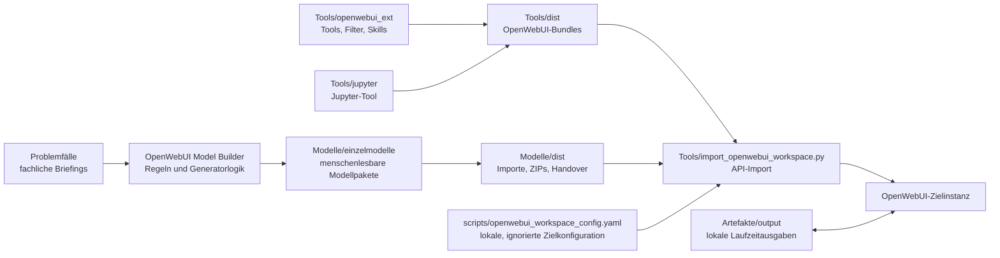

# Architektur

Dieses Repository ist ein portabler OpenWebUI-Workbench-Arbeitsbereich. Es enthält keine laufende Anwendung, sondern kuratierte Quellen, Generatorlogik, importierbare Artefakte und lokale Validierung.

## Komponenten

## Hauptbereiche

| Bereich | Aufgabe |
|---|---|
| `Problemfälle/` | Fachliche Ausgangspunkte für Modellpakete |
| `OpenWebUI Model Builder/` | Builder-Regeln und Generator-Arbeitsbereich |
| `Modelle/einzelmodelle/` | Primäre, menschenlesbare Modellablage |
| `Modelle/dist/` | Kanonische Übergabe- und Importartefakte |
| `Tools/jupyter/` | Kontrollierte Python-Ausführung über Jupyter |
| `Tools/openwebui_ext/` | OpenWebUI-Tools, Filter, Skills, Doku und Tests |
| `Tools/dist/` | Importierbare Tool-, Skill- und Function-Bundles |
| `scripts/` | Generator-, Validierungs- und Beispielkonfigurationsskripte |
| `Deployment/` | Offline-Compose- und Volume-Vorlagen |
| `Artefakte/` | Lokale Laufzeit- und Übergabedateien, normalerweise nicht versioniert |

## Generierungs- und Importfluss

1. Fachliche Anforderungen werden in `Problemfälle/` beschrieben.
2. Modellpakete werden in `Modelle/einzelmodelle/` gepflegt.
3. Tools, Filter und Skills werden unter `Tools/openwebui_ext/` gepflegt.
4. `scripts/configure_openwebui_tool_models.py` prüft und normalisiert Tool-, Filter- und Modellzuordnungen.
5. Der Generator schreibt Registries, Importdateien, Zusammenfassungen und ZIPs in `Modelle/dist/` und `Tools/dist/`.
6. `Tools/import_openwebui_workspace.py` kann diese Artefakte mit einer lokalen YAML-Konfiguration in eine OpenWebUI-Zielinstanz importieren.

## Validierung

Der zentrale Verify-Runner ist `scripts/verify_openwebui_workspace.py`. Er führt aus:

- Python-Syntax-Compile für `scripts` und `Tools`
- strukturelle Validierung von OpenWebUI-Tools, Filtern und Skills
- Generator-Check ohne Schreiboperation
- API-Import-Dry-Run mit Beispielkonfiguration
- Unit-Tests unter `Tools.openwebui_ext.tests`
- JSON-Validierung aller JSON-Dateien im Repository

## Sicherheitsgrenzen

- Echte OpenWebUI-Admin-Tokens, Jupyter-Tokens und lokale Zielkonfigurationen werden nicht versioniert.
- Netzwerkfähige Tools sind nicht Teil des Offline-Standardimports.
- Tools laufen in OpenWebUI serverseitig; Zielinstanzen müssen Valves, Dateisystem-Mounts und Admin-Rechte selbst absichern.
- `Artefakte/output/` und `Artefakte/temp/` sind lokale Laufzeitbereiche und werden außer `.gitkeep` ignoriert.

## Erweiterungspunkte

- Neue Problemfälle: `Problemfälle/`
- Neue Modellpakete: `Modelle/einzelmodelle/<modell-id>/`
- Neue OpenWebUI-Tools: `Tools/openwebui_ext/tools/`
- Neue Filter: `Tools/openwebui_ext/filters/`
- Neue Skills: `Tools/openwebui_ext/skills/`
- Neue Tests: `Tools/openwebui_ext/tests/`

Nach Änderungen an diesen Bereichen sollte mindestens `python scripts/verify_openwebui_workspace.py` laufen.
