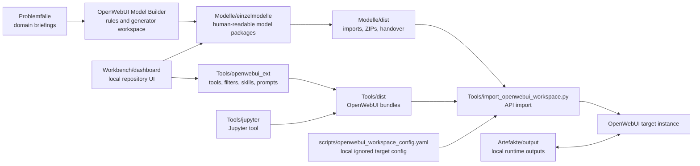

# Architecture

🌐 Languages: [Deutsch](../ARCHITECTURE.md) | [English](ARCHITECTURE.md)

This repository is a portable OpenWebUI workbench workspace. It does not contain a full running application; it contains curated sources, generator logic, importable artifacts, a local dashboard, and validation.

## Components

## Main Areas

| Area | Purpose |
|---|---|
| `Problemfälle/` | Domain starting points for model packages |
| `OpenWebUI Model Builder/` | Builder rules and generator workspace |
| `Modelle/einzelmodelle/` | Primary human-readable model store |
| `Modelle/dist/` | Canonical handover and import artifacts |
| `Tools/jupyter/` | Controlled Python execution through Jupyter |
| `Tools/openwebui_ext/` | OpenWebUI tools, filters, skills, prompt templates, docs, and tests |
| `Tools/dist/` | Importable tool, skill, prompt, and function bundles |
| `Workbench/dashboard/` | Local dashboard with German/English UI resources |
| `scripts/` | Generator, validation, and example configuration scripts |
| `Deployment/` | Offline Compose and volume templates |
| `Artefakte/` | Local runtime and handover files, usually not versioned |

## Generation and Import Flow

1. Domain requirements are described in `Problemfälle/`.
2. Model packages are maintained in `Modelle/einzelmodelle/`.
3. Tools, filters, skills, and prompt templates are maintained under `Tools/openwebui_ext/`.
4. `scripts/configure_openwebui_tool_models.py` checks and normalizes tool, filter, prompt, and model assignments.
5. The generator writes registries, import files, summaries, and ZIPs to `Modelle/dist/` and `Tools/dist/`.
6. `Tools/import_openwebui_workspace.py` can import these artifacts into a target OpenWebUI instance with a local YAML configuration.

## Large File Boundaries

Some files stay large because OpenWebUI expects importable single files or compact handover artifacts. New logic should still land at clear boundaries:

| File | Role | Change rule |
|---|---|---|
| `scripts/configure_openwebui_tool_models.py` | Orchestrates tool, filter, model, and dist generation | Move reusable validation or manifest logic into small helper modules under `scripts/` |
| `scripts/dist_zip_manifest.py` | Compares expected dist ZIP sources with ZIP contents | Keep ZIP and drift checks here instead of duplicating them in the generator |
| `Tools/openwebui_ext/tools/sub_agent.py` | Importable OpenWebUI tool with direct runtime integration | Keep the public tool class stable; extract only low-risk internal helpers |
| `Tools/openwebui_ext/tools/web_search_and_crawl.py` | Optional network profile for search and crawling | Keep network boundaries and optional dependencies local; do not make it an air-gap default |

During refactors the import surface matters more than file size: `Tools`/`Filter` classes, model JSON formats, registry schemas, and dist file names must not break as a side effect.

## Validation

The central verification runner is `scripts/verify_openwebui_workspace.py`. It runs Python syntax compilation, documentation language pair checks, secret hygiene checks, extension validation, generator checks, an import dry-run, JSON validation, and unit tests.

## Security Boundaries

Real OpenWebUI admin tokens, Jupyter tokens, and local target configurations are not versioned. Network-capable tools are not part of the offline default import. Target instances must secure their own authentication, network boundaries, tool valves, Jupyter sandboxing, filesystem mounts, and admin permissions.
